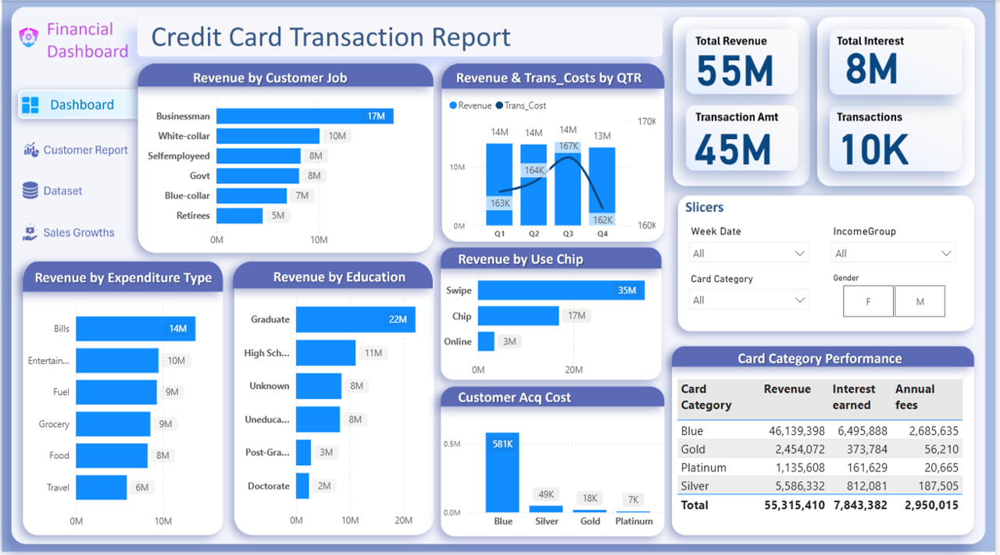
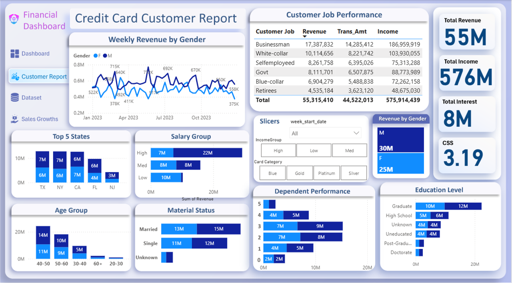

# Credit Card Financial Dashboard

## Project Overview

This project is a self-developed portfolio project focused on analyzing credit card customer behavior, financial performance, and risk indicators using Power BI, SQL, and structured datasets.

The objective of this project is to build an end-to-end data analytics solution that includes data modeling, data processing, dashboard development, and business insights generation in the banking domain.

The dashboard provides a complete view of customer transactions, demographics, credit utilization, and delinquency behavior to support financial decision-making.

---

## Problem Statement

Financial institutions need to understand customer spending patterns, credit usage behavior, and risk exposure in order to:

- Improve customer segmentation
- Monitor credit risk and delinquency
- Increase revenue through better financial insights
- Optimize credit limits and customer acquisition strategies
- Enhance overall business decision-making

This project addresses these requirements by building an interactive financial analytics dashboard.

---

## Datasets Used

This project uses two related datasets:

### Credit Card Transaction Data

Contains information related to customer transactions and credit card usage such as:

- Credit limit  
- Total transaction amount  
- Transaction volume  
- Utilization ratio  
- Payment methods  
- Spending categories  
- Interest earned  
- Delinquent account status  

### Customer Demographic Data

Contains customer profile information such as:

- Age and gender  
- Education level  
- Marital status  
- Income  
- Job type  
- Home and car ownership  
- Satisfaction score  

Both datasets are connected using a common key:

Client_Num

---

## Tools and Technologies

- Power BI for dashboard development and visualization  
- MySQL for data modeling and table creation  
- CSV files as raw data sources  
- DAX for calculated measures and KPIs  
- Data cleaning and transformation techniques  

---

## Key Performance Indicators (KPIs)

The dashboard tracks the following KPIs:

- Total Transaction Amount  
- Total Transaction Volume  
- Credit Utilization Ratio  
- Interest Earned  
- Customer Acquisition Cost  
- Delinquent Account Rate  
- Credit Limit Distribution  

---

## Dashboard Features

### Credit Card Financial Dashboard

Analysis of transaction trends, spending behavior, credit utilization, and payment methods.

### Customer Demographics Dashboard

Customer segmentation, demographic analysis, loan/ownership insights, and satisfaction scoring.

---

## Project Files

### Power BI Dashboard
- Credit Card Financial Dashboard.pbix  
https://github.com/Muhammad-Jan/Credit-Card-Customer-Financial-Dashboard/blob/main/Credit%20Card%20Financial%20Dashboard.pbix

### SQL Scripts
- SQL Query - Financial Dashboard Data  
https://github.com/Muhammad-Jan/Credit-Card-Customer-Financial-Dashboard/blob/main/SQL%20Query%20-%20Financial%20Dashboard%20Data.sql

---

## Author

Muhammad Jan  
Aspiring Data Analyst | Power BI | SQL | Python
